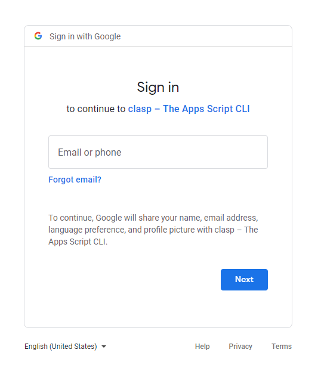
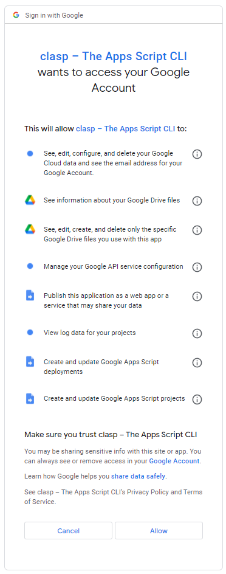
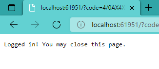
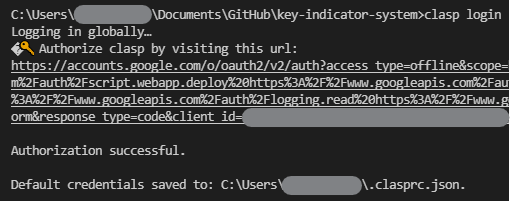

# Full Setup Guide: Getting GitHub -> Google AppScript up & running

## Prerequisites

1. Patience!
2. Computer running modern OS- Windows / Linux / MacOS will all work, but minor variations will exist depending on the operating system you use.
   1. This guide will focus on setting up with a Windows machine.
3. Administrator access- we will be installing some programs long enough to get data out of them.

## Step 0: Create or login to a GitHub account and fork [this](https://GitHub.com/texas-mcallen-mission/key-indicator-system) repository

- ⚠This is a REALLY important step!
- If you don't understand why GitHub is important or how it works, please watch this video for a brief explainer:
    <iframe width="560" height="315" src="https://www.youtube.com/embed/NHwiSlz4Bi4" title="GitHub in 60 Seconds" frameborder="0" allow="accelerometer; autoplay; clipboard-write; encrypted-media; gyroscope; picture-in-picture" allowfullscreen></iframe>

## Step 1: Download & Install node.js

1. go to [nodejs.org](https://nodejs.org/)
2. download the most recent LTS version
   1. 
3. Run the installer!  During the installation, check the box to automatically install some extra fancy build tools.  (Not sure if they're necessary, but they could be useful during development.)

| before | after |
| --- | --- |
|  |  |

## Step 2: Use Node Package Manager to install ``clasp``

1. open a command line and run ``npm install clasp``
   1. result should say something like this: ```added 1 package, and audited 2 packages in 25s```
2. run ``clasp login``
   1. Your default browser should pop up and look something like this:
      1. 
   2. Choose an account to use CLASP with.  If this is being done in another mission, you'll want to use an account that has access to the auto-updated Google Contacts data.
   3. Authorize CLASP to use your account.
      1. 
   4. Once you approve it, you should see a screen that looks like this:
      1. 
   5. Don't close out the command line just yet!  We'll need it for the next step.

## Step 3: Copy the ``.clasprc.json`` file to a GitHub Repository Secret

In the command line after you run ``clasp login`` you should see something that looks like this:


## Further Reading

> CLASP documentation
> GitHub Actions documentation
> the GitHub workflow I based my workflow on's documentation
